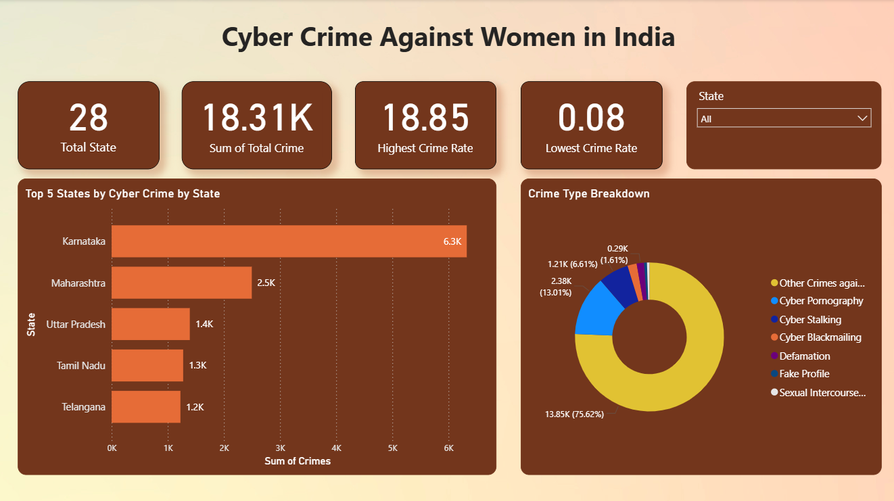
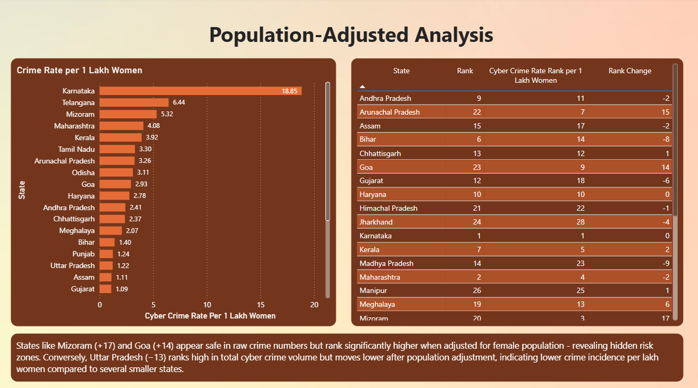
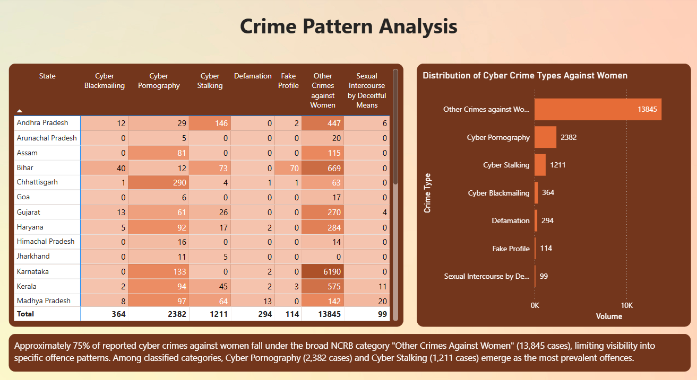
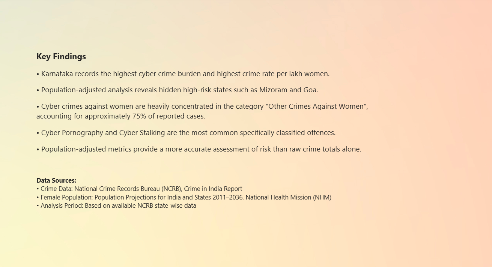

# 🔐 Cyber Crime Against Women in India — Data Analysis Dashboard

> An independent data analysis project examining state-wise cyber crimes against women across 28 Indian states using official government data sources.

---

## 📊 Project Overview

This project analyses cyber crimes against women across 28 Indian states using NCRB data. The goal is to uncover patterns, identify high-risk states, and demonstrate that raw crime numbers alone can be deeply misleading in policy analysis.

---
The Power BI dashboard file ([Cyber Crime.pbix](./Cyber%20Crime.pbix)) is included in this repository and can be opened using Microsoft Power BI Desktop.

To explore the dashboard interactively, download the PBIX file and open it using Power BI Desktop.

---

## 🎯 Objective

- Identify states with highest cyber crime burden against women
- Calculate population-adjusted crime rates per 1 lakh women
- Analyse rank changes between raw crime numbers and adjusted rates
- Understand the distribution of cyber crime types across states

---

## 🔍 Key Findings

- **Karnataka** records the highest cyber crime rate at **18.85 per lakh women** — significantly higher than all other states
- **Population-adjusted analysis** reveals hidden high-risk states — Mizoram jumped **+17 ranks** and Goa **+14 ranks** after adjustment
- **75%** of all reported cyber crimes fall under the broad NCRB category *"Other Crimes Against Women"*
- Among specifically classified offences, **Cyber Pornography (2,382 cases)** and **Cyber Stalking (1,211 cases)** are most prevalent
- **Uttar Pradesh** appears dangerous in raw numbers (rank 3) but drops to rank 16 after population adjustment — raw numbers alone mislead policy decisions

---

## 🧠 What I Learned

- Population-adjusted metrics provide more accurate risk assessment than raw crime totals
- Importance of data normalisation in policy-relevant analysis
- How to build multi-page interactive dashboards in Power BI
- Connecting multiple data sources (NCRB, NHM) for integrated analysis
- Translating complex data findings into clear policy insights

---

## 🛠️ Tools Used

- **Microsoft Excel** — data cleaning, pivot tables, conditional formatting, analysis
- **Power BI** — interactive 4-page dashboard
- **NCRB Crime in India Report** — primary crime dataset
- **NHM Population Projections** — female population data

---

## 📁 Data Sources

| Source | Data Used |
|---|---|
| National Crime Records Bureau (NCRB) | State-wise cyber crime data by type |
| National Health Mission (NHM) | Female population projections by state |
| Coverage | 28 Indian States |

---

## 🖥️ Dashboard Screenshots

### Page 1 — Overview

### Page 2 — Population-Adjusted Analysis

### Page 3 — Crime Pattern Analysis

### Page 4 — Key Findings

---

## 💡 Skills Demonstrated

- Data Cleaning
- Data Transformation
- Data Visualization
- Dashboard Design
- Power Query
- DAX
- Data Storytelling

---

## 👤 About

**Subashini S**
Research & Data Analyst | Social Impact | Gender Safety
📧 sakthiashini24@gmail.com
🔗 [LinkedIn](https://linkedin.com/in/s-subashini)

*Independent research project — 2026*
